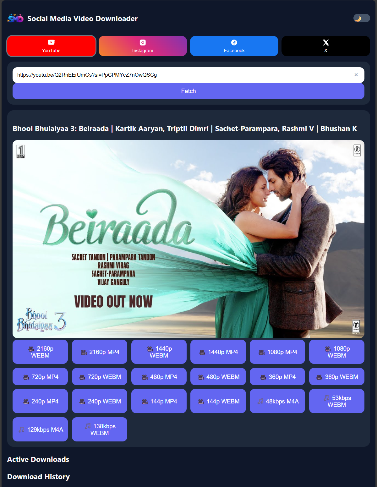

# 🎬 Social Media Video Downloader

A full-featured Social Media like YouTube, Instagram, Facebook, X(Twitter) video downloader built using **FastAPI + yt-dlp**.

This project allows users to: - 🎥 Download videos in all available
qualities (144p to 4K) - 🎵 Download audio-only formats - 🔄 Track
real-time download progress - ❌ Cancel downloads - 📜 View download
history - 📂 Automatically save files locally

------------------------------------------------------------------------

# 📁 Project Structure

After cloning, your project should look like this:

    SocialMediaVideoDownloader/
    │
    ├── backend.py
    ├── requirements.txt
    ├── README.md
    ├── .gitignore
    │
    ├── static/
    │     ├── index.html
    │     ├── script.js
    │     └── style.css
    │
    ├── downloads/        (auto-created)
    └── venv/             (NOT uploaded to GitHub)

⚠ Important: - `venv/` should NOT be uploaded. - `downloads/` should NOT
be uploaded. - These must be ignored using `.gitignore`.

------------------------------------------------------------------------

# 💻 Preview

------------------------------------------------------------------------

# 🛠 Requirements

-   Python 3.9 or higher
-   pip

Check Python version:

    python --version

------------------------------------------------------------------------

# 📦 Installation Guide (For Viewers)

## 1️⃣ Clone the Repository

    git clone https://github.com/akash098p/SocialMediaVideoDownloader.git
    cd SocialMediaVideoDownloader

------------------------------------------------------------------------

## 2️⃣ Create Virtual Environment

Windows:

    python -m venv venv
    venv\Scripts\activate

Mac/Linux:

    python3 -m venv venv
    source venv/bin/activate

------------------------------------------------------------------------

## 3️⃣ Install Dependencies

    pip install -r requirements.txt

If requirements.txt is missing:

    pip install fastapi uvicorn yt-dlp python-multipart

------------------------------------------------------------------------

# 🚀 Running the Project (Local Only)

## 1️⃣ Start Backend Server

    uvicorn backend:app --reload --port 8000

Backend runs at:

    http://127.0.0.1:8000

------------------------------------------------------------------------

## 2️⃣ Start Frontend Server

Open a new terminal (keep backend running), then:

    python -m http.server 8080 --directory static

Frontend runs at:

    http://127.0.0.1:8080

Now open in browser:

    👉👉 http://127.0.0.1:8080 👈👈

------------------------------------------------------------------------

# 📂 Downloaded Files

All downloaded videos/audio files are stored in:

    downloads/

This folder is automatically created when the backend runs.

------------------------------------------------------------------------

# ⚠ Important Notes

-   GitHub Pages cannot run this project (requires Python backend).
-   This project is designed for local execution.
-   Cloud hosting may face YouTube bot detection issues.

------------------------------------------------------------------------

# 🧠 Technologies Used

-   FastAPI
-   yt-dlp
-   Python
-   HTML / CSS / JavaScript

------------------------------------------------------------------------

# 👨‍💻 Author

Akash Pramanik

------------------------------------------------------------------------

# ⭐ If you found this project useful, consider giving it a star!
